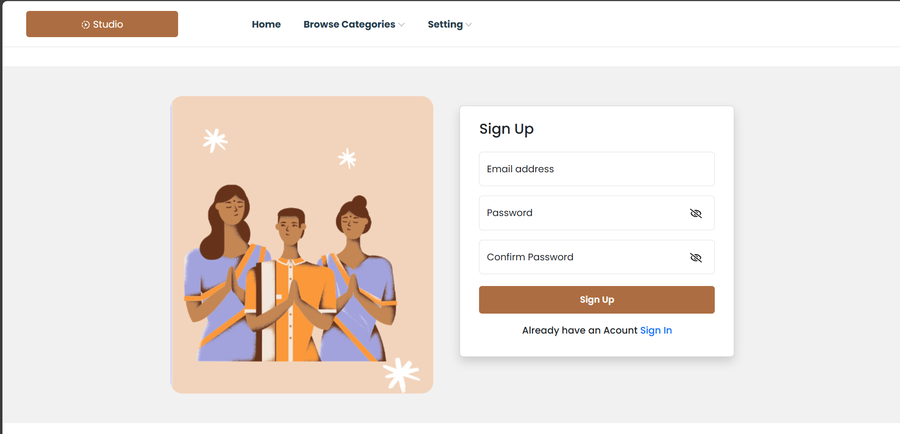

# 🌸 Culture Cart - [Namaste.com](#)  
**Where Indian Tradition Meets Global Hearts**

Welcome to **Culture Cart** — your gateway to the soul of India!  
Discover, connect, and celebrate with handcrafted treasures brought to you by local Indian artisans.  

> 🧵 *“Preserving heritage, empowering artisans — one product at a time.”*

---

## 📖 About Culture Cart

**Culture Cart** is a vibrant e-commerce platform built using **React.js**, designed to bridge the gap between local Indian artisans and a global audience. We aim to preserve India’s rich traditions and bring them to the world by offering a seamless shopping experience for unique, handmade goods.

From **Puja Samagri** of Kumartuli to **Terracotta arts** of Bishnupur, each product is a living story of craftsmanship, culture, and community.

---

## 🚀 Features

✨ Modern, user-focused features for a beautiful shopping experience:

- 🔐 **Secure Authentication**  
  Email & Google OAuth login/signup for a personalized journey.

- 🛍️ **Rich Product Listings**  
  Browse diverse artisan crafts with detailed product views.

- 🛒 **Smart Shopping Cart**  
  Add, remove, and manage items effortlessly.

- ❤️ **Wishlist Functionality**  
  Save your favorite products to explore later.

- 📱 **Fully Responsive Design**  
  Seamless experience across all screen sizes.

- ⚙️ **Mock API Integration**  
  Uses `db.json` for quick data simulation and testing.

- 💡 **Modern Frontend Architecture**  
  Built with React.js using Context API and Hooks for state management.

---

## 🧰 Tech Stack

| Frontend | Backend (Mock) | Auth | State |
|----------|----------------|------|-------|
| React.js | JSON Server (`db.json`) | Google OAuth, Custom Login | React Context API, Hooks |

---

## 🖼️ Screenshots

Visualizing the Culture Cart experience:

- 
- 
- 
- 
- 
- 

---
## 👥 Contributors

This project is a group effort by the following amazing team members:

- 🧑‍💻 **Mital Patil**  
- 👩‍💻 **Samiksha Suryawanshi**  


Thank you all for your dedication and creativity!

---

## 🛠️ Getting Started

Run Culture Cart locally in a few simple steps:

```bash
# 1. Clone the repository
git clone https://github.com/17mital/culture_cart.git

# 2. Navigate to the project folder
cd culture_cart

# 3. Install dependencies
npm install

# 4. Start the development server
npm run dev


